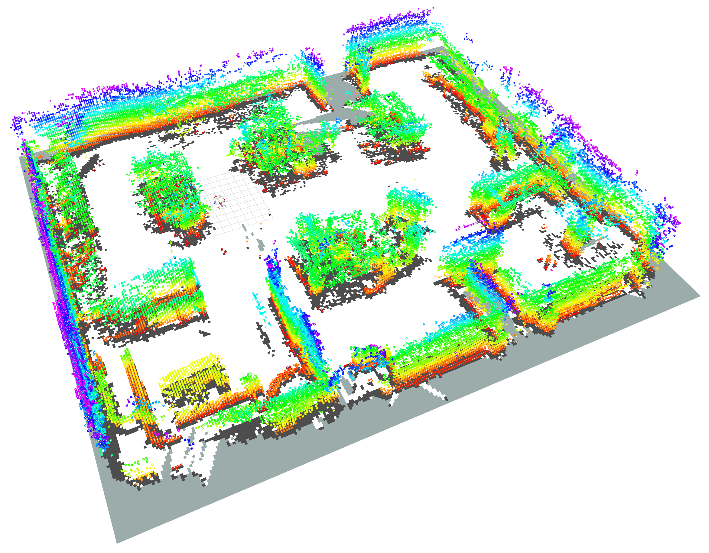

# Sensor Ring Library

> 💡 **The EduArt Sensor Ring library is the high level software interface of the EduArt sensor boards.**

<div align="center">

<table  class="markdownTable">
    <tr class="markdownTableRowOdd">
        <td>Source Code</td>
        <td>
            <a href="https://github.com/EduArt-Robotik/edu_lib_sensorring"></a>
            <a href="https://github.com/EduArt-Robotik/edu_lib_sensorring/releases/latest"></a>
        </td>
    </tr>
    <tr class="markdownTableRowEven">
        <td class="markdownTableBodyNone">
            License
        </td>
        <td class="markdownTableBodyNone">
            <a href="https://github.com/EduArt-Robotik/edu_lib_sensorring/blob/master/LICENSE"></a>
        </td>
    </tr>
</table>

</div>

## Quick Start Guide

Choose your target platform or target framework for a quick start guide:

<div align="center">

<table  class="markdownTable">
    <tr class="markdownTableRowOdd">
        <td class="markdownTableBodyNone">
            Target Platform
        </td>
        <td class="markdownTableBodyNone">
            <a href="doc/pages/installation.md"></a>
            <a href="doc/pages/installation.md"></a>
        </td>
    </tr>
    <tr class="markdownTableRowEven">
        <td class="markdownTableBodyNone">
            Target Framework
        </td>
        <td class="markdownTableBodyNone">
            <a href="https://github.com/EduArt-Robotik/edu_lib_sensorring/blob/master/apps/examples/cpp"></a>
            <a href="https://github.com/EduArt-Robotik/edu_lib_sensorring/blob/master/apps/examples/python"></a>
            <a href="https://github.com/EduArt-Robotik/edu_sensorring_ros1"></a>
            <a href="https://github.com/EduArt-Robotik/edu_sensorring_ros2"></a>
        </td>
    </tr>
</table>

</div>

## Application Example

<div align="center">
<table style="border: none;">
  <tr>
    <td style="text-align:center">
      <br>
      A Raspberry Pi based EduBot equipped 12 sensor boards.
    </td>
    <td style="text-align:center">
      <br>
      3D map of an office room recorded with the EduBot and <a href="https://octomap.github.io/">Octomap.</a>
    </td>
  </tr>
</table>
</div>

## Hardware

> ℹ️ Have a look at the [hardware guide](doc/pages/01_hardware.md) on how to set up and use the sensors with your computer.

## Installation

> ℹ️ Have a look at the [installation guide](doc/pages/02_installation.md) on how build the library on your platform.

### Quick Start - Use the library in other CMake projects

```cmake
include(FetchContent)
FetchContent_Declare(
  sensorring
  URL      https://github.com/EduArt-Robotik/edu_lib_sensorring/archive/refs/heads/master.zip
  DOWNLOAD_EXTRACT_TIMESTAMP OFF
)

FetchContent_MakeAvailable(sensorring)
add_library(sensorring::sensorring ALIAS sensorring)
```


### Quick Start - Build and install the library from source

<div class="tabbed">

- <b class="tab-title">**Quick start Linux**</b><div class="darkmode_inverted_image">

  ```sh
  git clone https://github.com/EduArt-Robotik/edu_lib_sensorring
  mkdir -p edu_lib_sensorring/build
  cd edu_lib_sensorring/build
  cmake .. -DCMAKE_BUILD_TYPE=Release -DBUILD_EXAMPLES=ON
  cmake --build . -j4
  sudo cmake --install
  ```
</div>

- <b class="tab-title">**Quick start Windows**</b><div class="darkmode_inverted_image">

  ```powershell
  git clone https://github.com/EduArt-Robotik/edu_lib_sensorring
  mkdir edu_lib_sensorring/build
  cd edu_lib_sensorring/build
  cmake .. -DCMAKE_BUILD_TYPE=Release -DBUILD_EXAMPLES=ON
  cmake --build . --config=Release -- -j4
  cmake --install . --config=Release # Requires terminal with admin privileges
  ```
</div>
</div>


## Software

> ℹ️ Have a look at the [software guide](doc/pages/03_software.md) on how to use the library in your own projects.


<div class="section_buttons"> 

| | Read Next |
|:--|--:|
| | [Hardware](doc/pages/01_hardware.md) |

</div>