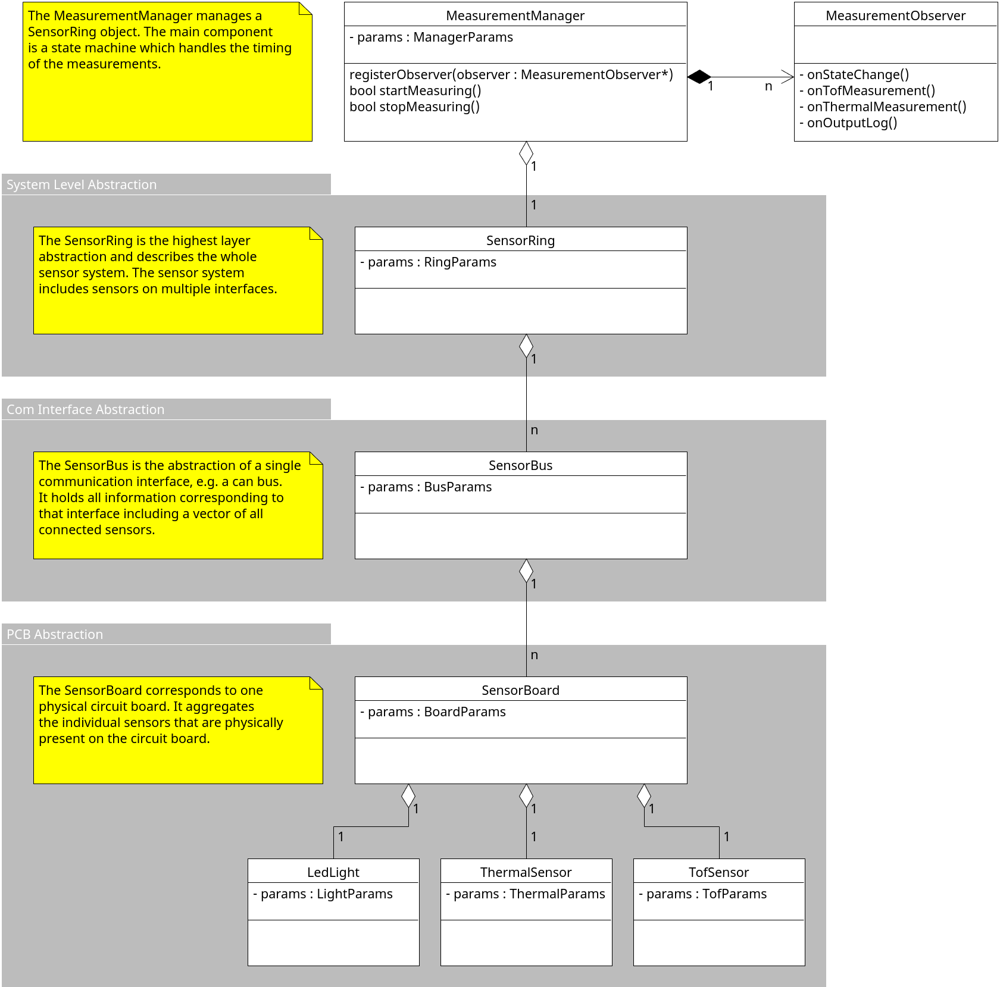

# Sensorring Library
Software interface of the EduArt Sensorring.

## 1. Hardware
The sensorring library supports a variety of EduArt sensor boards. See the table below for the currently supported hardware:

|  
Edu Headlight
 
  
 | 
- Headlight of the Raspberry Pi based EduBot   - ST VL53L8CX 8 × 8 Time-of-Flight sensor   -Optional Heimann HTPA32 thermal sensor   - 11 RGB Leds   - CANFD Interface 
|
|---|---|
|  
Edu Taillight
 
  
 | - Taillight of the Raspberry Pi based EduBot   - ST VL53L8CX 8 × 8 Time-of-Flight sensor   - 2 RGB Leds   - CANFD Interface |
|  
Edu Sidepanel
 
  
 | - General Purpose sensor board   - ST VL53L8CX 8 × 8 Time-of-Flight sensor   - 2 RGB Leds   -38 × 28 mm   - CANFD Interface|
|  
Edu Minipanel
 | - General Purpose sensor board   - ST VL53L8CX 8 × 8 Time-of-Flight sensor   - 28 × 24 mm    - CANFD Interface|

## 1. Sensor topology

The EduArt Sensorring is a sensor system that collects and combines measurements from multiple individual sensors. The individual sensors are daisy chained together in series and share a communication interface and a power supply. The chain of sensor is terminated by a master device at one end e.g. a Raspberry Pi or a CAN to USB converter. It is possible to use multiple communication interfaces to distribute the sensor data and enable the use of more sensors simultaneously. The following class diagram illustrates the topology and the reflection of the hardware layers in the library.

## 2. Input Parameters

Each of the core classes of the library has its own parameter set which is shown in the above class diagram. The parameters have to be initialized externally and passed to the MeasurementManager upon initialization. The individual parameters are described [here](doc/parameters.md). See section _3. Software interface of the library_ for details on how the parameter structures are implemented.

## 3. Software interface of the library

See [here](doc/sw_interface.md) for a description of the software interface of the library.

## 4. Building and installing the library

See [here](doc/build_guide.md) for a guide on how to build and install the library.

## 5. Using the library in a custom project

Please refer to to the [Ros](https://github.com/EduArt-Robotik/edu_sensorring_ros1) and [Ros2](https://github.com/EduArt-Robotik/edu_sensorring_ros2) wrappers of this library for examples on how to use the library in your own project.