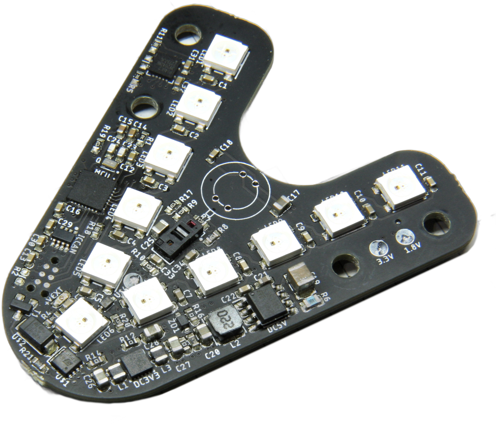
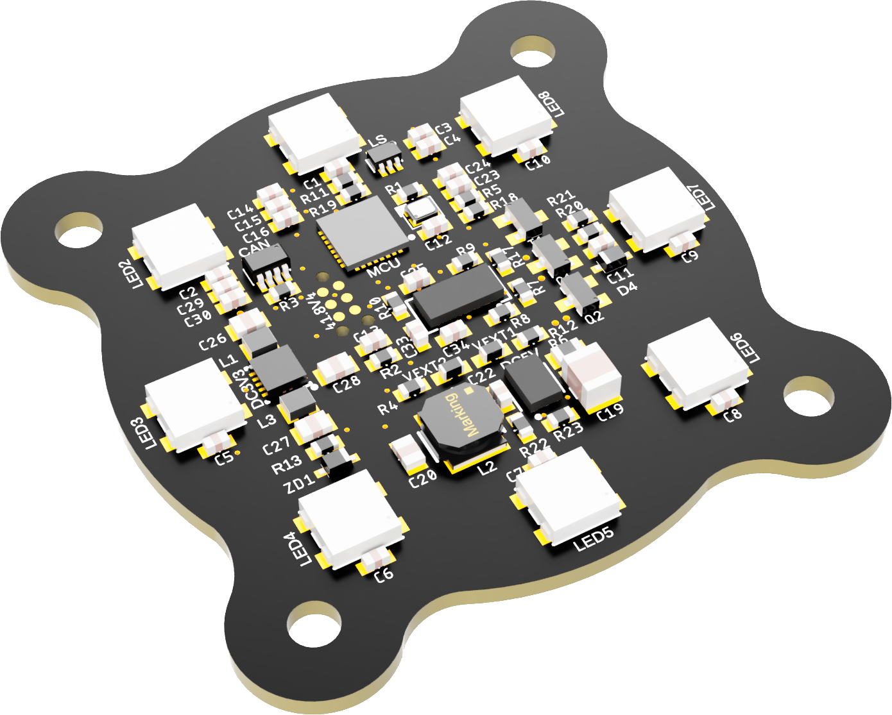
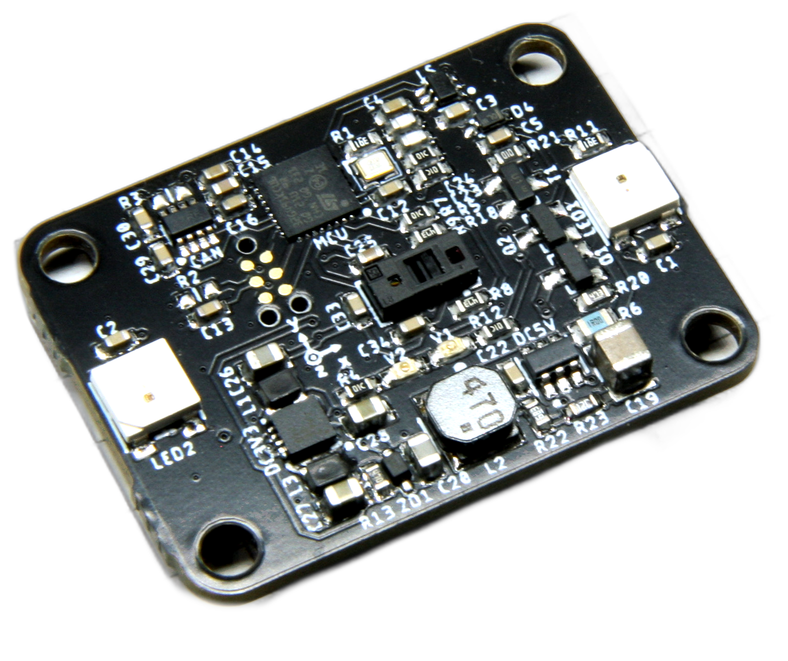

# Sensorring Library
Software interface of the EduArt Sensorring.

## 1. Hardware
The sensorring library supports a variety of EduArt sensor boards. See the table below for the currently supported hardware:

|  Edu Headlight   
  
 | - Headlight of the Raspberry Pi based EduBot   - ST VL53L8CX 8 × 8 Time-of-Flight sensor   -Optional Heimann HTPA32 thermal sensor   - 11 RGB Leds|
|---|---|
|  Edu Taillight   
  
 | - Taillight of the Raspberry Pi based EduBot   - ST VL53L8CX 8 × 8 Time-of-Flight sensor   - 2 RGB Leds  |
|  Edu Sidepanel   
  
 | - General Purpose sensor board   - ST VL53L8CX 8 × 8 Time-of-Flight sensor   - 2 RGB Leds   -38 × 28 mm|
|  Edu Minipanel | - General Purpose sensor board   - ST VL53L8CX 8 × 8 Time-of-Flight sensor   - 28 × 24 mm  |

## 1. Sensor topology

See [here](doc/topology.md) for a description of the whole sensor system.

## 2. Input Parameters

See [here](doc/parameters.md) for a description of the parameters.

## 3. Software interface of the library

See [here](doc/sw_interface.md) for a description of the software interface of the library.

## 4. Building and installing the library

See [here](doc/build_guide.md) for a guide on how to build and install the library.

## 5. Using the library in a custom project

See [here](doc/using_the_library.md) for a guide on how to use the software in a custom project.