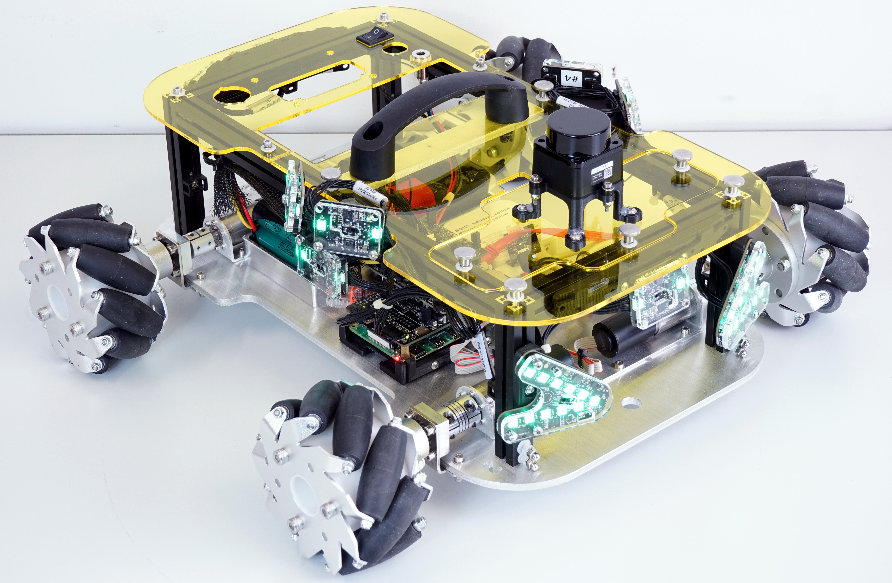

# Sensor Ring Library
Software interface of the EduArt Sensor Ring.

## 1. Application example

A Raspberry Pi based EduBot equipped with a sensor ring consisting of 12 individual sensor boards.



Close-up view of the three front facing sensors of the EduBot.


A 3D map of an office room recorded with the above EduBot and [Octomap](https://octomap.github.io/).


## 1. Hardware
### 1.1 Supported Sensors
The sensorring library supports a variety of EduArt sensor boards. See the table below for the currently supported hardware:

| <p align="center">Sensor Board Type</p> | <p align="center">Description</p> |
|---|---|
|  <p align="center">Edu Headlight</p> <p align="center">  </p> | <p align="left">- Headlight of the Raspberry Pi based EduBot <br> - ST VL53L8CX 8 × 8 Time-of-Flight sensor <br> - Optional Heimann HTPA32 thermal sensor <br> - 11 RGB Leds <br> - CAN FD Interface <br> - Input voltage range 6 V - 65 V DC</p>|
|  <p align="center">Edu Taillight</p> <p align="center">  </p> | - Taillight of the Raspberry Pi based EduBot <br> - ST VL53L8CX 8 × 8 Time-of-Flight sensor <br> - 2 RGB Leds <br> - CAN FD Interface<br> - Input voltage range 6 V - 65 V DC |
|  <p align="center">Edu Sidepanel</p> <p align="center">  </p> | - General purpose sensor board <br> - ST VL53L8CX 8 × 8 Time-of-Flight sensor <br> - 2 RGB Leds <br> - 38 × 28 mm <br> - CAN FD Interface<br> - Input voltage range 6 V - 65 V DC|
|  <p align="center">Edu Minipanel</p> <p align="center">  </p> | - General purpose sensor board <br> - ST VL53L8CX 8 × 8 Time-of-Flight sensor <br> - 28 × 24 mm  <br> - CAN FD Interface<br> - Input voltage range 6 V - 65 V DC|

### 1.1 Hardware setup
The Sensorring library currently only implements the Linux SocketCAN interface for communication with the Sensors. Therefore the recommended setup is a Linux environment with a CAN FD adapter. Possible hardware configurations are:

- A Raspberry Pi with an EduArt CAN FD to SPI shield. The shield provides two independent CAN FD interfaces that can be used for the sensors. Refer to [this guide](https://github.com/EduArt-Robotik/edu_robot/blob/main/documentation/setup/raspberry/setup_raspberry.md) on how to set up a Raspberry Pi with an EduArt Can shield.
- A generic Linux machine with a CAN FD to USB converter. In this case an additional external power supply is needed to power the sensors. Refer to the manual of your CAN FD to USB converter for a installation guide.

After setting up your environment check if one or more CAN interfaces are active with `ifconfing`. The output should show at least one running CAN interface.

```
eduart-can0: flags=193<UP,RUNNING,NOARP>  mtu 72
unspec 00-00-00-00-00-00-00-00-00-00-00-00-00-00-00-00  txqueuelen 10  (UNSPEC)
RX packets 0  bytes 0 (0.0 B)
RX errors 0  dropped 0  overruns 0  frame 0
TX packets 0  bytes 0 (0.0 B)
TX errors 0  dropped 0 overruns 0  carrier 0  collisions 0
device interrupt 170
```

## 2. Sensor topology

The EduArt Sensorring is a sensor system that collects and combines measurements from multiple individual sensors. The individual sensors are daisy chained together in series and share a communication interface and a power supply. The chain of sensor is terminated by a master device at one end e.g. a Raspberry Pi or a CAN to USB converter. It is possible to use multiple communication interfaces to distribute the sensor data and enable the use of more sensors simultaneously. The following class diagram illustrates the topology and the reflection of the hardware layers in the library.


## 3. Input Parameters

Each of the core classes of the library has its own parameter set which is shown in the above class diagram. The parameters have to be initialized externally and passed to the MeasurementManager upon initialization. The individual parameters are described [here](doc/pages/parameters.md). See section _3. Software interface of the library_ for details on how the parameter structures are implemented.

## 4. Software interface of the library

The main software interface of the Sensorring library is defined in three header files which are installed with the library.
- [MeasurementManger.hpp](include/sensorring/MeasurementManager.hpp)
- [MeasurementClient.hpp](include/sensorring/MeasurementClient.hpp)
- [Parameters.hpp](include/sensorring/Parameters.hpp)

Implementation details of the interface are explained [here](doc/pages/sw_interface.md).


## 5. Building and installing the library
The library is built with a standard CMake workflow.
To build the library execute the following commands starting in the root of the repository:
```
mkdir build
cd build
cmake ..
cmake --build . -j
```

Use this command to install the library to a custom location:
```
cmake --install . --prefix <install-path>
```

If the library is installed to a non-standard location, the directory should be added to the `CMAKE_PREFIX_PATH` environment variable. This enables cmake to find and include the library automatically in other projects. Add an export command to your .bashrc script or edit the environment variable file of your OS to set the path permanently.

```
export CMAKE_PREFIX_PATH=$CMAKE_PREFIX_PATH:<install-path>
```


For an automatic build and automatic installation the above commands are also available as convenience scripts [make_release.bash](cmake/make_release.bash) and [install_release.bash](cmake/install_release.bash). These scripts should be called from the root of the repository.

```
cmake/make_release.bash
```
```
cmake/install_release.bash
```
>**Note on the convenience scripts**:<br>If the bash script does not execute it may need to be converted to a file with unix style line endings. Run `dos2unix ./cmake/*` for an automatic conversion before executing the script.

> **Notes on the installation script:**<br>  - The installation script automatically runs the build script before installing the library. <br>- The installation path in the script is hard-coded and should be changed if desired. <br> - Don't forget to set the `CMAKE_PREFIX_PATH` when using the script.

In addition to the make and install scripts there is a [remove_installation.bash](cmake/remove_installation.bash) cleanup script that removes the library when it is installed at the default installation location.
```
cmake/remove_installation.bash
```

## 6. Supported languages

### C++
The library is written in c++ and primarily designed to be used as such.

### Python
The library can be built to include automatically generated python bindings.


## 7. Using the library in a custom project
The library includes both C++ and Python [examples](/apps/examples/) that show how to create a minimal program using the Sensor Ring.
For further references on how to use the library in custom projects refer to the [Ros](https://github.com/EduArt-Robotik/edu_sensorring_ros1) and [Ros2](https://github.com/EduArt-Robotik/edu_sensorring_ros2) wrappers of this library.
Both show how to include the library in larger CMake projects.


## 8. Developer documentation
Refer to the [developer documentation](doc/pages/dev_doc.md) for more details on how the library is implemented.
