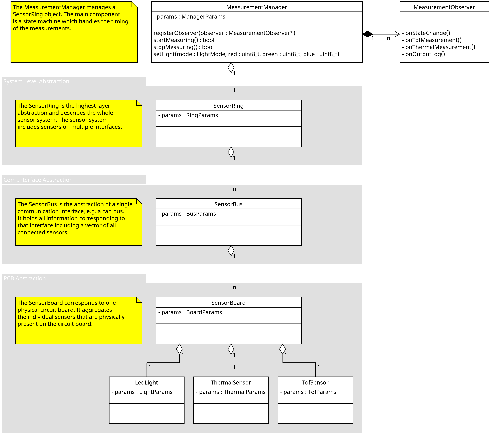

# Sensorring Library
Software interface of the EduArt Sensorring.

## 1. Hardware
The sensorring library supports a variety of EduArt sensor boards. See the table below for the currently supported hardware:


|  <p align="center">Edu Headlight</p> <p align="center">  </p> | <p align="left">- Headlight of the Raspberry Pi based EduBot <br> - ST VL53L8CX 8 × 8 Time-of-Flight sensor <br> -Optional Heimann HTPA32 thermal sensor <br> - 11 RGB Leds <br> - CANFD Interface <br> - Input voltage range 6 V - 65 V DC</p>|
|---|---|
|  <p align="center">Edu Taillight</p> <p align="center">  </p> | - Taillight of the Raspberry Pi based EduBot <br> - ST VL53L8CX 8 × 8 Time-of-Flight sensor <br> - 2 RGB Leds <br> - CANFD Interf<br> - Input voltage range 6 V - 65 V DCace |
|  <p align="center">Edu Sidepanel</p> <p align="center">  </p> | - General purpose sensor board <br> - ST VL53L8CX 8 × 8 Time-of-Flight sensor <br> - 2 RGB Leds <br> -38 × 28 mm <br> - CANFD Inter<br> - Input voltage range 6 V - 65 V DCface|
|  <p align="center">Edu Minipanel</p> <p align="center">  </p> | - General purpose sensor board <br> - ST VL53L8CX 8 × 8 Time-of-Flight sensor <br> - 28 × 24 mm  <br> - CANFD Inter<br> - Input voltage range 6 V - 65 V DCface|


## 1. Sensor topology

The EduArt Sensorring is a sensor system that collects and combines measurements from multiple individual sensors. The individual sensors are daisy chained together in series and share a communication interface and a power supply. The chain of sensor is terminated by a master device at one end e.g. a Raspberry Pi or a CAN to USB converter. It is possible to use multiple communication interfaces to distribute the sensor data and enable the use of more sensors simultaneously. The following class diagram illustrates the topology and the reflection of the hardware layers in the library.



## 2. Input Parameters

Each of the core classes of the library has its own parameter set which is shown in the above class diagram. The parameters have to be initialized externally and passed to the MeasurementManager upon initialization. The individual parameters are described [here](doc/parameters.md). See section _3. Software interface of the library_ for details on how the parameter structures are implemented.

## 3. Software interface of the library

The software interface of the Sensorring library is defined in four header files which are installed with the library.
- [MeasurementManger.hpp](include/sensorring/MeasurementManager.hpp)
- [MeasurementObserver.hpp](include/sensorring/MeasurementObserver.hpp)
- [Parameters.hpp](include/sensorring/types/Parameters.hpp)
- [CustomTypes.hpp](include/sensorring/types/install_types/CustomTypes.hpp)

Implementation details of the interface are explained [here](doc/sw_interface.md).

## 4. Building and installing the library


To build the library execute the following commands starting in the root of the repository:
```
mkdir build
cd build
cmake ../cmake
cmake --build . -j
```

Use this command to install the library to a custom location:
```
cmake --install . --prefix <install-path>
```

If the library is installed to a non-standard location, the directory should be added to the `CMAKE_PREFIX_PATH` environment variable. This enables cmake to find and include the library automatically in other projects. Add an export command to your .bashrc script or edit the environment variable file of your OS to set the path permanently.

```
export CMAKE_PREFIX_PATH=$CMAKE_PREFIX_PATH:<install-path>
```


For an automatic build and automatic installation the above commands are also available as convenience scripts [make_release.bash](cmake/make_release.bash) and [install_release.bash](cmake/install_release.bash). These scripts should be called from the root of the repository.

```
cmake/make_release.bash
```
```
cmake/install_release.bash
```
> **Notes on the installation script:**<br>  - The installation script automatically runs the build script before installing the library. <br>- The installation path in the script is hard-coded and should be changed if desired. <br> - Don't forget to set the `CMAKE_PREFIX_PATH` when using the script.


## 5. Using the library in a custom project

Please refer to to the [Ros](https://github.com/EduArt-Robotik/edu_sensorring_ros1) and [Ros2](https://github.com/EduArt-Robotik/edu_sensorring_ros2) wrappers of this library for examples on how to use the library in your own project.