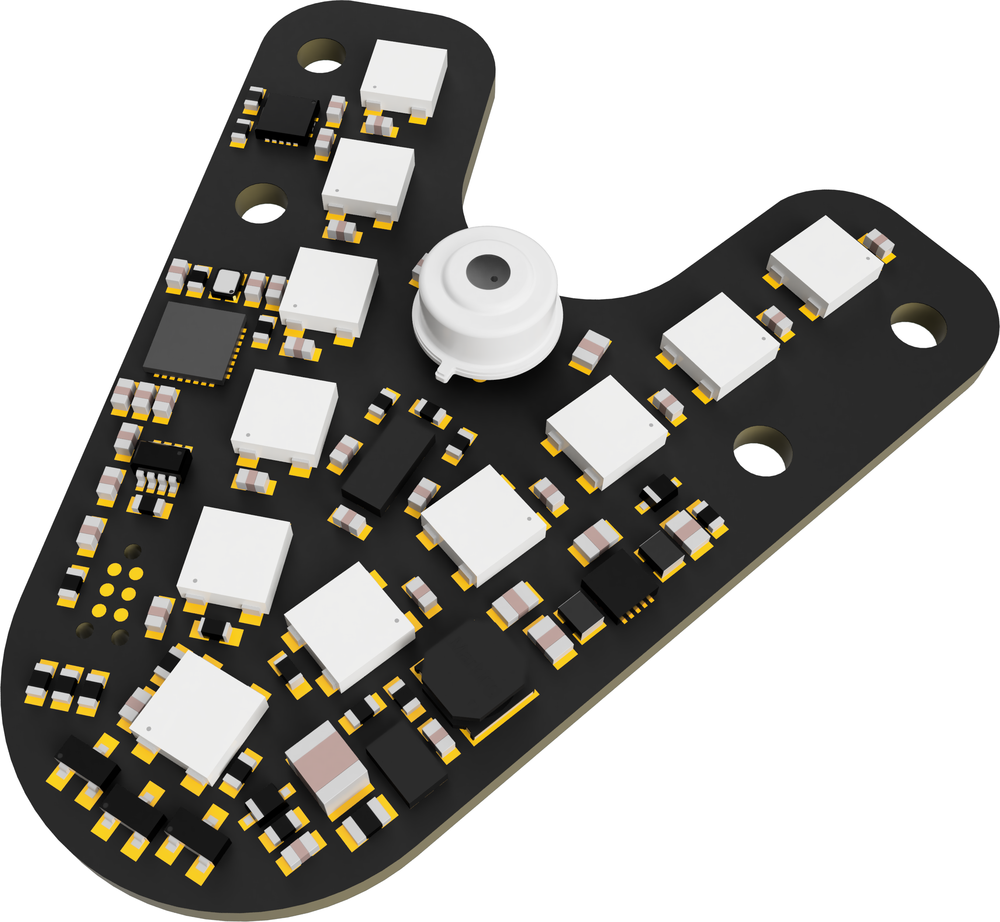

# Hardware

## 1 EduArt Sensor Boards

The table below shows the current versions of the EduArt sensor boards that can be used with the EduArt Sensor Ring library.

<div align="center">
<table>
	<tr>
		<th style="text-align:center"><p>Sensor Board Type</p></th>
		<th style="text-align:center"><p>Description</p></th>
	</tr>
	<tr>
		<td style="text-align:center">
			<p><b>Edu Headlight</b></p>
			<p></p>
		</td>
		<td style="text-align:left">
			- Headlight of the Raspberry Pi based EduBot <br>
			- ST VL53L8CX 8 × 8 Time-of-Flight sensor <br>
			- Optional Heimann HTPA32 thermal sensor <br>
			- 11 Addressable RGB Leds <br>
			- CAN FD Interface <br>
			- Input voltage range 6 V - 65 V DC
		</td>
	</tr>
	<tr>
		<td style="text-align:center">
			<p><b>Edu Taillight</b></p>
			<p></p>
		</td>
		<td style="text-align:left">
			- Taillight of the Raspberry Pi based EduBot <br>
			- ST VL53L8CX 8 × 8 Time-of-Flight sensor <br>
			- 2 Addressable RGB Leds <br>
			- CAN FD Interface<br>
			- Input voltage range 6 V - 65 V DC
		</td>
	</tr>
	<tr>
		<td style="text-align:center">
			<p><b>Edu Sidepanel</b></p>
			<p></p>
		</td>
		<td style="text-align:left">
			- General purpose sensor board <br>
			- ST VL53L8CX 8 × 8 Time-of-Flight sensor <br>
			- 2 Addressable RGB Leds <br>
			- 38 × 28 mm <br>
			- CAN FD Interface<br>
			- Input voltage range 6 V - 65 V DC
		</td>
	</tr>
	<tr>
		<td style="text-align:center">
			<p><b>Edu Minipanel</b></p>
			<p></p>
		</td>
		<td style="text-align:left">
			- General purpose sensor board <br>
			- ST VL53L8CX 8 × 8 Time-of-Flight sensor <br>
			- 28 × 24 mm  <br>
			- CAN FD Interface<br>
			- Input voltage range 6 V - 65 V DC
		</td>
	</tr>
</table>
</div>


## 2 Main Components of the Sensor Boards

### 2.1 ST VL53L8CX Time of Flight sensor

### 2.2 Heimann HTPA32 Thermophile array

### 2.3 WS2812b Addressable RGB LED


## 3 Supported Communication Interfaces

### 3.1 SocketCAN 

The Sensor Ring library implements the Linux specific SocketCAN interface to communicate with the sensors.
The SocketCAN interface can be used on most Linux machines by using a CAN FD USB adapter with Linux Kernel support or through a SPI to CAN FD adapter for embedded computers like a Raspberry Pi.

To use the SocketCAN interface type you need to connect a compatible CAN adapter to your computer and start the interface.

```sh
sudo ip link set can0 up type can bitrate 1000000 dbitrate 5000000 fd on
```

> ⚠️ The EduArt sensors have a fixed baud rates of 1 Mbps nominal and 5 Mbps for the data. Make sure your interface matches these rates.

Use the `ifconfig` or `ip addr` command to verify that the CAN interfaces are up and running. In this example we have the CAN interface `can0` up and running.

```sh
$ ifconfig
can0: flags=193<UP,RUNNING,NOARP>  mtu 72
      unspec 00-00-00-00-00-00-00-00-00-00-00-00-00-00-00-00  txqueuelen 10  (UNSPEC)
      RX packets 0  bytes 0 (0.0 B)
      RX errors 0  dropped 0  overruns 0  frame 0
      TX packets 0  bytes 0 (0.0 B)
      TX errors 0  dropped 0 overruns 0  carrier 0  collisions 0
      device interrupt 170
```


### 3.1.1 EduArt Raspberry Pi Adapter

EduArt provides a [RaspberryPi adapter shield](https://eduart-robotik.com/products/kinematicskit-kim/) that provides two independent CAN FD interfaces reserved for the sensors.
Refer to [this guide](https://github.com/EduArt-Robotik/edu_robot/blob/main/documentation/setup/raspberry/setup_raspberry.md) on how to set up a Raspberry Pi with the EduArt adapter shield.
After the setup of the shield you should see three running CAN interfaces with the `ifconfig` or `ip addr` command.

<div style="text-align:center">
<br>
A Raspberry Pi with the EduArt adapter shield and one minipanel sensor board.
</div>

### 3.1.2 SocketCAN USB Adapter

The SocketCAN interface can also be used on most Linux machines with a CAN FD adapter with Linux Kernel support like the [candleLightFD](https://linux-automation.com/de/products/candlelight-fd.html) adapter.
These adapters are super easy to use:

1. Connect the adapter via USB to your computer.
2. Run `sudo ip link set can0 up type can bitrate 1000000 dbitrate 5000000 fd on` to start the interface.
3. Verify that the interface is running with the `ifconfig` or `ip addr` command.
4. Optional: Create a UDEV rule that automatically starts the interface when the adapter is connected.

```sh
sudo bash -c 'echo "ACTION==\"add\", SUBSYSTEM==\"usb\", ATTR{idVendor}==\"1d50\", ATTR{idProduct}==\"606f\", TAG+=\"systemd\", ENV{SYSTEMD_WANTS}=\"candlelight-can0.service\"" > /etc/udev/rules.d/50-candlelight.rules'
sudo bash -c 'echo -e "#!/bin/bash\n\n# Wait for CAN interface to appear (up to 5 seconds)\nfor i in {1..10}; do\n    if ip link show can0 >/dev/null 2>&1; then\n        break\n    fi\n    sleep 0.5\ndone\n\n# Bring up CAN FD\n/usr/sbin/ip link set can0 up type can bitrate 1000000 dbitrate 5000000 fd on" > /usr/local/bin/start_can0.sh'
sudo chmod +x /usr/local/bin/start_can0.sh
sudo udevadm control --reload-rules
sudo udevadm trigger
```

<div style="text-align:center">
<br>
A CandlightFD CAN FD to USB adapter with one minipanel sensor board.
</div>

### 3.2 USBtingo USB Adapter  

In addition to the Linux only SocketCAN interface the Sensor Ring library also has the cross platform USBtingo CAN FD to USB interface implemented.
The USBtingo can be used from from both Linux and Windows.
To use this interface the library [libusbtingo](https://github.com/hannesduske/libusbtingo) for this adapter needs to be installed and the Sensor Ring library needs to be build with the `-DUSE_USBTINGO=ON` option.

> ⚠️ The USBtingo is not recognized as CAN device by the Linux Kernel. The commands from the SocketCAN compatible adapter above don't work for this device.

<div style="text-align:center">
<br>
A USBtingo CAN FD to USB adapter with one minipanel sensor board.
</div>

## 4 Connecting the Sensor Ring

The sensor boards of the Sensor Ring are daisy chained together with Molex Pico-Lock 7 pin cables.
The boards connectors on the boards don't have an orientation or polarity and all of the boards can be joined in any order and orientation.
The chain of sensors then needs to be terminated by a suitable computer, i.e. a RaspberryPi with the EduArt shield or a computer with CAN FD to usb adapter.


<div align="center">
<table style="border: none;">
<tr>
	<td style="text-align:center">
		<br>
		Top view of a sensor chain with two minipanels with a USBtingo as adapter.
	</td>
	<td style="text-align:center">
		<br>
		Bottom view of a sensor chain with two minipanels with a USBtingo as adapter.
	</td>
</tr>
</table>
</div>


<div class="section_buttons"> 

| Read Previous | Read Next |
|:--|--:|
| [Readme](../../README.md) | [Installation](02_installation.md) |

</div>