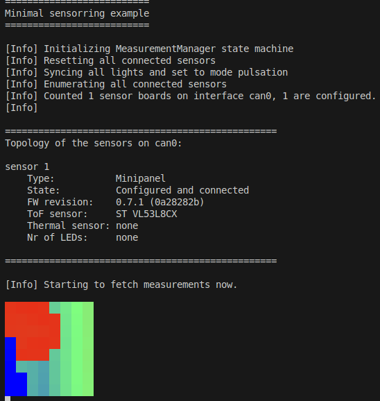
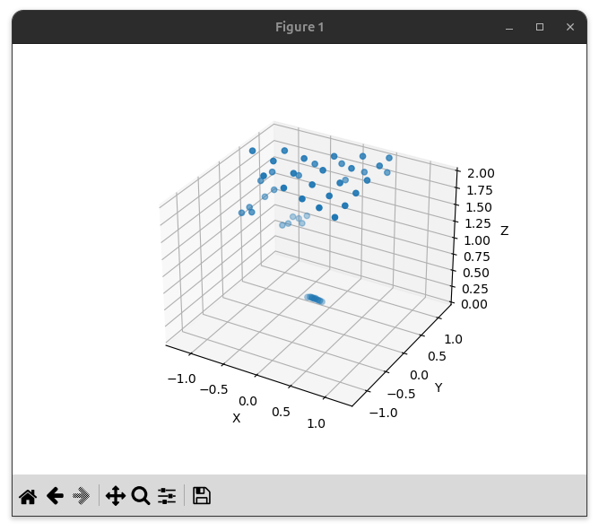
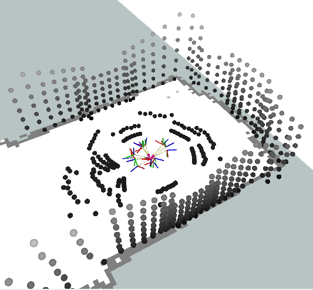
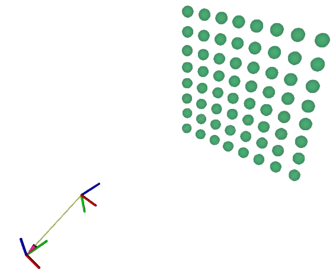

# Software

## 1. Public Interface of the Sensor Ring Library

### 1.1 Measurement Interface

The public interface has **three measurement related components**:

- The **MeasurementManager**:<br>
  This class executes the measurements, collects them and distributes them to all registered clients. It is responsible for the timing of the measurement process. The measurements can either be run asynchronously in a separate thread with the `startMeasuring()` and `stopMeasuring()` methods, or in the users thread by repeatedly calling the `measureSome()` method.

- The **MeasurementClient**<br>
  The MeasurementClient is the observer interface, which gets notified by the Logger when new measurements are available. All MeasurementClient instances that should receive measurements must be registered with the MeasurementManager.

- The **ManagerParams**<br>
  This is the parameter set that configures the system. The ManagerParams are a cascaded structure, that represents the topology of the system as shown in the diagram below..

### 1.1 Logger Interface

In addition to the measurement related interface the library provides a **logger interface**:

- The **Logger**<br>
  The Logger collects all debug, info and error messages that are raised internally and forwards them to the registered LoggerClients.

- The **LoggerClient**<br>
  The LoggerClient is the observer interface, which gets notified by the Logger when new log messages are available. All LoggerClient instances that should receive log messages must be registered with the Logger.

## 2. Topology of the System

The EduArt Sensor Ring is a system that collects and combines measurements from multiple individual sensors.
The individual sensors are daisy chained together in series and share a communication interface and a power supply.
The chain of sensor is terminated by a master device at one end e.g. a Raspberry Pi or a CAN to USB converter.
It is possible to use multiple communication interfaces to distribute the sensor data and enable the use of more sensors simultaneously.
The following class diagram illustrates the topology and the reflection of the hardware layers in the library.

<div style="text-align:center">

</div>

## 3. Input Parameters

Each of the core classes of the library has its own parameter set which is shown in the above class diagram.
The parameters are designed to mirror the private internal structure of the library.
This means the `ManagerParams` has one element `RingParams` and the `RingParams` has a vector of `BusParams` which mirrors the 1 to n relationship between `SensorRing` and `SensorBus`.
Each `SensorBus` has a vector of `BoardParams`, which again represents the real system where multiple boards can be connected on one interface.

The parameters have to be initialized and configured externally and passed to the `MeasurementManager` as constructor argument upon creation.
Once a `MeasurementManager` has been instantiated the parameters can no longer be changed.

  > ⚠️ Be careful to configure the actual number of connected communication interfaces (where each interface is one SensorBus) and the correct number of sensor boards per interface.
  If the `ManagerParams` parameter `enforceTopology` is set to `true` the system **will only start if the configuration matches the connected hardware exactly**.


## 4. Minimal Examples for the Supported Languages

The Sensor Ring library includes both [C++ examples](https://github.com/EduArt-Robotik/edu_lib_sensorring/blob/master/apps/examples/cpp) and [Python examples](https://github.com/EduArt-Robotik/edu_lib_sensorring/blob/master/apps/examples/python) that show how to use it in custom projects.


### 4.1 C++ <a href="https://github.com/EduArt-Robotik/edu_lib_sensorring/blob/master/apps/examples/cpp"></a>

The library is written in C++ and it is recommended to use the C++ interface of the library for performance reasons.

The following examples show how to use the Sensor Ring library in your own C++ project:

- [Minimal Example](https://github.com/EduArt-Robotik/edu_lib_sensorring/blob/master/apps/examples/cpp/minimal/src/main.cpp): Displays the current measurement rate
- [Depth Map Example](https://github.com/EduArt-Robotik/edu_lib_sensorring/blob/master/apps/examples/cpp/depth_map/src/main.cpp): Displays a depth map of the ToF measurement on the command line


### 4.2 Python <a href="https://github.com/EduArt-Robotik/edu_lib_sensorring/blob/master/apps/examples/python"></a>
The library can be built with `-DBUILD_PYTHON_BINDINGS=ON` option to generate python bindings.

The following examples show how to use the Sensor Ring library in your own Python project:

- [Minimal Example](https://github.com/EduArt-Robotik/edu_lib_sensorring/blob/master/apps/examples/cpp/minimal/src/main.cpp): Displays the current measurement rate
- [Depth Map Example](https://github.com/EduArt-Robotik/edu_lib_sensorring/blob/master/apps/examples/cpp/depth_map/src/main.cpp): Displays a depth map of the ToF measurement on the command line
- [Depth View Example](https://github.com/EduArt-Robotik/edu_lib_sensorring/blob/master/apps/examples/cpp/depth_view/src/main.cpp): Displays a 3D plot of the ToF measurement on the command line using [matplotlib](https://matplotlib.org/)

<div align=center>
<table style="border: none;">
<tr>
  <td style="text-align:center">
    <br>
    The `depth_view` example shows ToF measurements as depth images.
  </td>
  <td style="text-align:center">
    <br>
    The Python only `depth_map` example shows ToF measurements as 3D plots.
  </td>
</tr>
</table>
</div>

The use of the Python interface is similar to that of the C++ interface with a few exceptions that are explained below.

C++ has the two client interface classes `MeasurementClient` and `LoggerClient`.
With the generated Python bindings it is not possible to inherit from both base classes in one python class simultaneously.
Only the first base class is handled correctly, the second one is not recognized correctly and throws an error when trying to registering it.
For this reason the Python interface has the additional `SensorringClient` class, which combines the callbacks from both `MeasurementClient` and `LoggerClient` in one class.

> ⚠️ Use the `SensorringClient` base class in Python to inherit from both `MeasurementClient` and `LoggerClient`.

> ⚠️ It is strongly recommended to clone measurements to numyp arrays before manipulating it. This is shown in the `onRawTofMeasurement()` callback below.

Below is a minimal example that shows the Python specialities discussed above:

```python
import numpy as np
import eduart.sensorring as sensorring

class MeasurementProxy(sensorring.SensorringClient):
  def __init__(self):
    # Initialize base class
    super().__init__()
    self._points_np = np.zeros((64, 6), dtype=np.float64)

  # Base class callback
  def onRawTofMeasurement(self, measurement_vec):
    measurement_vec[0].point_cloud.copyTo(self._points_np)
  
  # Base class callback
  def onOutputLog(self, verbosity, msg):
    print("[" + sensorring.LogVerbosityToString(verbosity) + "] " + msg)


def main():
  # Create the parameter structure that is used to instantiate the sensorring
  params = sensorring.ManagerParams()
  # (Actually configure the parameters here...)

  # Instantiate a Measurement proxy
  proxy = MeasurementProxy()

  # Register the proxy with the Logger to get the log output
  sensorring.Logger.getInstance().registerClient(proxy)

  try:
    # Instantiate a MeasurementManager with the parameters from above
    manager = sensorring.MeasurementManager(params)

    # Register the proxy with the LogMeasurementManager to get the measurements
    manager.registerClient(proxy)

    # Start the measurements
    manager.startMeasuring()

    while (manager.isMeasuring()):
      # (Actually do something useful here ...)
      pass

    # Stop the measurements
    manager.stopMeasuring()

  except Exception as e:
    print("Caught: ", e)

if __name__ == "__main__":
    main()
```

## 5. Wrappers for Other Frameworks

In addition the the examples, the Sensor Ring library has provides for [ROS](https://github.com/EduArt-Robotik/edu_sensorring_ros1) and [ROS2](https://github.com/EduArt-Robotik/edu_sensorring_ros2) which make the integration of the EduArt Sensor Ring in existing projects easy.
 
### 5.1 ROS <a href="https://github.com/EduArt-Robotik/edu_sensorring_ros1"></a>

The Ros1 wrapper publishes the Time of Flight Sensor measurements as [PointCloud2](hhttps://docs.ros.org/en/noetic/api/sensor_msgs/html/msg/PointCloud2.html) message and the thermal measurements as [Image](https://docs.ros.org/en/noetic/api/sensor_msgs/html/msg/Image.html) message.
In addition the pose of each sensor is published as a static transformation.

> ℹ️ The parameters of the Sensor Ring are fully defined in the [ROS parameter file](https://github.com/EduArt-Robotik/edu_sensorring_ros1/blob/master/params/edu_bot_sensorring_params.yaml) and just have to be adjusted to the individual sensor configuration.

### 5.2 ROS2 <a href="https://github.com/EduArt-Robotik/edu_sensorring_ros2"></a>

The Ros2 wrapper publishes the Time of Flight Sensor measurements as [PointCloud2](https://docs.ros2.org/foxy/api/sensor_msgs/msg/PointCloud.html) message and the thermal measurements as [Image](https://docs.ros2.org/foxy/api/sensor_msgs/msg/Image.html) message.
In addition to the sensor messages the pose of each sensor is published as a static transformation.

> ℹ️ The parameters of the Sensor Ring are fully defined in the [ROS2 parameter file](https://github.com/EduArt-Robotik/edu_sensorring_ros2/blob/master/params/edu_bot_sensorring_params.yaml) and just have to be adjusted to the individual sensor configuration.

<div align=center>
<table style="border: none;">
<tr>
  <td style="text-align:center">
    <br>
    3D point cloud from the sensor system on a mobile robot at the end of a corridor visualized with Rviz.
  </td>
  <td style="text-align:center">
    <br>
    3D map of a corridor recorded with the sensor system using <a href="https://octomap.github.io/">Octomap.</a> visualized with Rviz.
  </td>
</tr>
</table>
</div>

<div class="section_buttons"> 

| Read Previous | Read Next |
|:--|--:|
| [Installation](02_installation.md) | [Developer Documentation](04_dev_doc.md) |

</div>