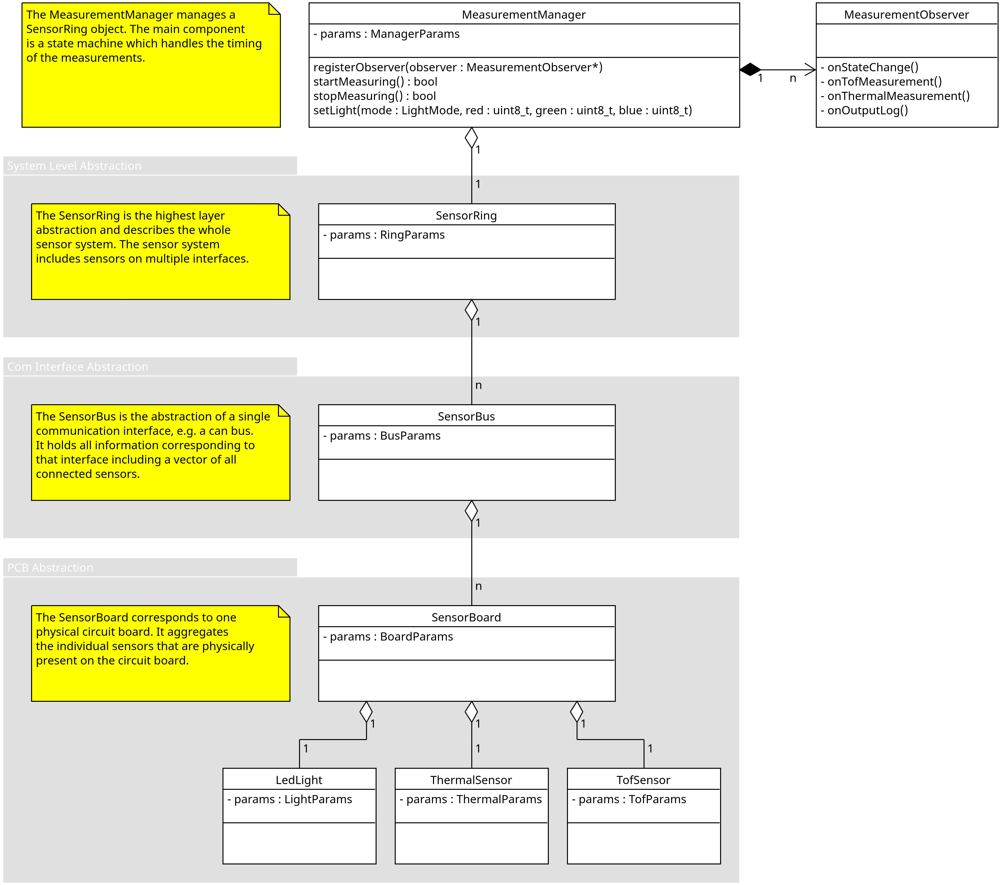

# Software

## 1. Public Interface of the Sensor Ring Library

### 1.1 Measurement Interface

The public interface has **three measurement related components**:

- The **MeasurementManager**:<br>
  This class executes the measurements, collects them and distributes them to all registered clients. It is responsible for the timing of the measurement process. The measurements can either be run asynchronously in a separate thread with the `startMeasuring()` and `stopMeasuring()` methods, or in the users thread by repeatedly calling the `measureSome()` method.

- The **MeasurementClient**<br>
  The MeasurementClient is the observer interface, which gets notified by the Logger when new measurements are available. All MeasurementClient instances that should receive measurements must be registered with the MeasurementManager.

- The **ManagerParams**<br>
  This is the parameter set that configures the system. The ManagerParams are a cascaded structure, that represents the topology of the system as shown in the diagram below..

### 1.2 Logger Interface

In addition to the measurement related interface the library provides a **logger interface**:

- The **Logger**<br>
  The Logger collects all debug, info and error messages that are raised internally and forwards them to the registered LoggerClients.

- The **LoggerClient**<br>
  The LoggerClient is the observer interface, which gets notified by the Logger when new log messages are available. All LoggerClient instances that should receive log messages must be registered with the Logger.

## 2. Topology of the System

The EduArt Sensor Ring is a system that collects and combines measurements from multiple individual sensors.
The individual sensors are daisy chained together in series and share a communication interface and a power supply.
The chain of sensor is terminated by a master device at one end e.g. a Raspberry Pi or a CAN to USB converter.
It is possible to use multiple communication interfaces to distribute the sensor data and enable the use of more sensors simultaneously.
The following class diagram illustrates the topology and the reflection of the hardware layers in the library.

<div style="text-align:center">

</div>

## 3. Sensor Ring Factory

The `SensorRingFactory` is the primary way to create a `SensorRing` instance.
It handles hardware discovery, board validation and device instantiation in a single `build()` call.

### 3.1 Basic Usage

The minimal workflow is:

1. Create a factory instance
2. Register communication interfaces with `addInterface()`
3. Optionally declare expected boards with `expectBoard()`
4. Call `build()` to enumerate hardware and construct the `SensorRing`

```cpp
ring::SensorRingFactory factory;
factory.addInterface(interface);
auto sensor_ring = factory.build(ring::ValidationMode::Relaxed);
```

The returned `SensorRing` is passed to the `MeasurementManager` as before:

```cpp
manager::ManagerParams params;
auto manager = std::make_unique<manager::MeasurementManager>(params, std::move(sensor_ring));
```

### 3.2 Validation Modes

The `build()` method accepts a `ValidationMode` that controls how expectations are matched against discovered hardware.

| Mode | Behaviour |
|:-----|:----------|
| **Strict** | Expectations are matched 1:1 by index against discovered boards. Any mismatch in board type, device type or board count returns `nullptr`. |
| **Relaxed** | For each expectation the factory **searches** all unclaimed boards for the first compatible one. Boards that are not claimed by any expectation remain unconfigured. Mismatches are logged as warnings. |

In strict mode the order and count of `expectBoard()` calls must match the physical bus exactly.
In relaxed mode the factory finds compatible boards regardless of their position on the bus.

### 3.3 Configuring Board Expectations

**Auto-discovery** (no expectations): every board found on the bus is used with default configuration.

```cpp
factory.addInterface(interface);
auto sensor_ring = factory.build(ring::ValidationMode::Relaxed);
```

**Board type constraint**: only boards of the specified type are accepted.

```cpp
factory.expectBoard({ device::SensorBoardType::Headlight });
```

**Explicit device params**: only the specified device types are instantiated on the matched board.

```cpp
factory.expectBoard({}, { device::HTPA32_Params{} });
```

**Default device params**: applied to every device of that type when no explicit params are given.

```cpp
factory.setDefaultDeviceParams(device::VL53L8CX_Params{ .resolution = 4 });
```

### 3.4 Enumeration and Topology

The factory can enumerate hardware without building a `SensorRing`:

```cpp
auto results = factory.enumerate();
std::cout << factory.printTopology();
```

The `EnumerationMap` returned by `enumerate()` or `getLatestEnumerationResult()` maps each `ComInterfaceID` to a vector of `EnumerationInformation` structs that report board type, connection state, configuration state and available device types.

## 4. Input Parameters

The `ManagerParams` configure the runtime behaviour of the `MeasurementManager`.
They are passed as constructor argument and cannot be changed after instantiation.

| Parameter | Description |
|:----------|:------------|
| `timeout` | Duration after which the manager shuts down automatically |
| `enable_brs` | Enable CAN FD bit rate switching |
| `repair_errors` | Attempt automatic error recovery |
| `frequency_tof_hz` | Target frequency for ToF measurements |
| `frequency_thermal_hz` | Target frequency for thermal measurements |

<div class="section_buttons"> 

| Read Previous | Read Next |
|:--|--:|
| [Installation](02_installation.md) | [Examples](05_examples.md) |

</div>