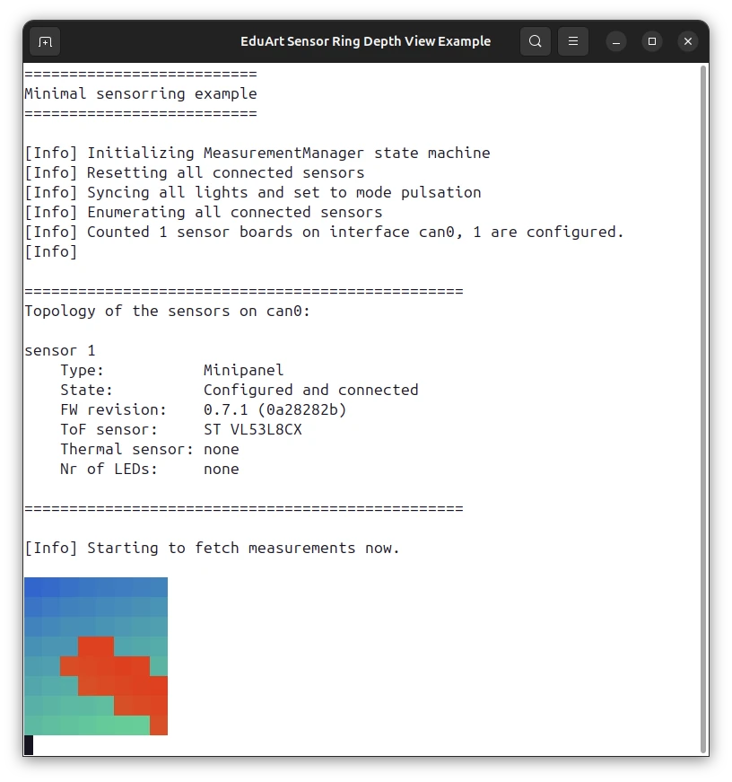
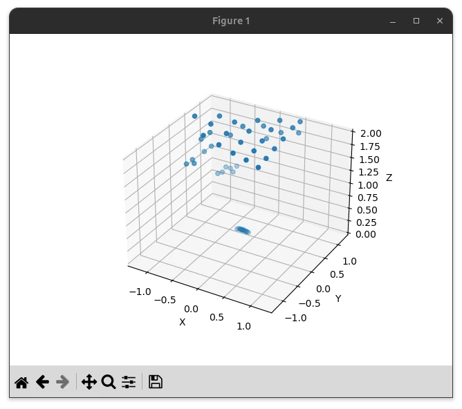

# Examples

The Sensor Ring library includes both [C++ examples](https://github.com/EduArt-Robotik/edu_lib_sensorring/blob/master/apps/examples/cpp) and [Python examples](https://github.com/EduArt-Robotik/edu_lib_sensorring/blob/master/apps/examples/python) that show how to use it in custom projects.

> ⚠️ **Interface:** All examples register both a **SocketCAN** and an **USBtingo** interface by default. The `SensorRingFactory` auto-discovery will use whichever interface is available on your system. Depending on your setup, you may need to adjust the interface names (e.g. the SocketCAN device name or the USBtingo device index) in the respective example source file. Note that SocketCAN is only available on Linux.


## 1. C++ <a href="https://github.com/EduArt-Robotik/edu_lib_sensorring/blob/master/apps/examples/cpp"></a>

The library is written in C++ and it is recommended to use the C++ interface of the library for performance reasons.

The following examples show how to use the Sensor Ring library in your own C++ project:

### Measurement Rate Examples

The first three examples are **functionally identical** — they all use the `SensorRingFactory` for auto-discovery and display the current ToF and thermal measurement rate on the command line. They differ only in the programming pattern used to receive measurements:

- [Minimal Example](https://github.com/EduArt-Robotik/edu_lib_sensorring/blob/master/apps/examples/cpp/minimal/src/main.cpp) (**function-based**): Subscribes to device groups and state changes using lambda callbacks directly on the `MeasurementManager`
- [Proxy Class Example](https://github.com/EduArt-Robotik/edu_lib_sensorring/blob/master/apps/examples/cpp/proxy_class/src/main.cpp) (**object-oriented**): Wraps the subscription logic in a custom proxy class that binds its member functions as callbacks via `std::bind`
- [Client Interface Example](https://github.com/EduArt-Robotik/edu_lib_sensorring/blob/master/apps/examples/cpp/client_interface/src/main.cpp) (**client interface**): Inherits from the optional `MeasurementClient` and `LoggerClient` interfaces and overrides their virtual callback methods

### Visualization and Action Examples

- [Depth Map Example](https://github.com/EduArt-Robotik/edu_lib_sensorring/blob/master/apps/examples/cpp/depth_map/src/main.cpp): Prints a colored 8×8 depth map of the first connected ToF sensor on the command line
- [Thermal Map Example](https://github.com/EduArt-Robotik/edu_lib_sensorring/blob/master/apps/examples/cpp/thermal_map/src/main.cpp): Prints a 32×32 false-color thermal image from the first connected HTPA32 sensor on the command line
- [Extra Action Example](https://github.com/EduArt-Robotik/edu_lib_sensorring/blob/master/apps/examples/cpp/extra_action/src/main.cpp): Demonstrates how to use `enqueueExtraAction()` to control WS2812b LEDs with a smooth color cycling animation

> ⚠️ To use the `depth_map` or `thermal_map` C++ examples on Windows you might first need to enable UTF-8 support for your current terminal session with this command:<br/>
`$OutputEncoding = [Console]::OutputEncoding = New-Object System.Text.UTF8Encoding`.

## 2. Python <a href="https://github.com/EduArt-Robotik/edu_lib_sensorring/blob/master/apps/examples/python"></a>
> ℹ️ The library can be built with `-DSENSORRING_BUILD_PYTHON_BINDINGS=ON` option to generate python bindings.

> ⚠️ To use the `sensorring` python package you have to append the location of the package to your `PYTHONPATH` environment variable.

> ⚠️ It is strongly recommended to copy measurements to NumPy arrays before manipulating them in Python. This is shown in the `onRawTofMeasurement()` callback in the `depth_view` and `sigma_histogram` examples using `point_cloud.copyTo()`.

<div class="tabbed">

- <b class="tab-title">**Linux**</b><div class="darkmode_inverted_image">
    ```sh
    export PYTHONPATH=$PYTHONPATH:/usr/local/lib/python3/dist-packages
    ```
    
  </div>

- <b class="tab-title">**Windows**</b><div class="darkmode_inverted_image">
    ```ps
    $env:PYTHONPATH = "${env:PYTHONPATH};C:\Program Files\EduArt Robotik GmbH\Sensor Ring\bindings\python3"
    $env:EDU_SENSORRING_DIR = "C:\Program Files\EduArt Robotik GmbH\Sensor Ring\"
    ```
    Alternatively you can use the Windows `Edit the System Environment Variables` tool to add the python package location to the environment variable `PYTHONPATH`.

  </div>
</div>

The following examples show how to use the Sensor Ring library in your own Python project.

### Measurement Rate Examples

The first three examples are **functionally identical** — they all use the `SensorRingFactory` for auto-discovery and display the current ToF and thermal measurement rate on the command line. They differ only in the programming pattern used to receive measurements:

- [Minimal Example](https://github.com/EduArt-Robotik/edu_lib_sensorring/blob/master/apps/examples/python/minimal/minimal.py) (**function-based**): Subscribes to device groups and state changes using Python callbacks directly on the `MeasurementManager`
- [Proxy Class Example](https://github.com/EduArt-Robotik/edu_lib_sensorring/blob/master/apps/examples/python/proxy_class/proxy_class.py) (**object-oriented**): Wraps the subscription logic in a custom proxy class that binds its member methods as callbacks
- [Client Interface Example](https://github.com/EduArt-Robotik/edu_lib_sensorring/blob/master/apps/examples/python/client_interface/client_interface.py) (**client interface**): Inherits from the optional `MeasurementClient` and `LoggerClient` interfaces and overrides their virtual callback methods

### Visualization Examples

- [Depth Map Example](https://github.com/EduArt-Robotik/edu_lib_sensorring/blob/master/apps/examples/python/depth_map/depth_map.py): Prints a colored 8×8 depth map of the first connected ToF sensor on the command line
- [Thermal Map Example](https://github.com/EduArt-Robotik/edu_lib_sensorring/blob/master/apps/examples/python/thermal_map/thermal_map.py): Prints a 32×32 false-color thermal image from the first connected HTPA32 sensor on the command line
- [Depth View Example](https://github.com/EduArt-Robotik/edu_lib_sensorring/blob/master/apps/examples/python/depth_view/depth_view.py): Displays a live 3D scatter plot of the ToF measurement using [matplotlib](https://matplotlib.org/)
- [Sigma Histogram Example](https://github.com/EduArt-Robotik/edu_lib_sensorring/blob/master/apps/examples/python/sigma_histogram/sigma_histogram.py): Displays a live histogram of the sigma (standard deviation) of valid ToF points using [matplotlib](https://matplotlib.org/)

<div align=center>
<table style="border: none;">
<tr>
  <td style="text-align:center">
    <br>
    The `depth_map` example
  </td>
  <td style="text-align:center">
    <br>
    The `depth_view` example.
  </td>
</tr>
</table>
</div>

Below is a minimal example that shows how to set up the SensorRing and receive measurements in Python using the function-based subscription API:

```python
import time
import eduart.sensorring as sensorring


def main():
  params = sensorring.ManagerParams()

  # Set up the communication interface
  interface = sensorring.ComInterfaceID()
  interface.type = sensorring.InterfaceType_USBTINGO
  interface.name = "0"

  try:
    # Subscribe to the log messages
    log_sub = sensorring.Logger.getInstance().subscribe(
      lambda verbosity, msg:
        print(f"[{sensorring.LogVerbosityToString(verbosity)}] {msg}")
        if verbosity > sensorring.LogVerbosity_Debug else None
    )

    # Create the SensorRing via auto-discovery
    factory = sensorring.SensorRingFactory()
    factory.addInterface(interface)
    sensor_ring = factory.build(sensorring.ValidationMode_Relaxed)

    if sensor_ring is None:
      print("Failed to create SensorRing. Exiting.")
      return

    # Create the MeasurementManager with the SensorRing
    manager = sensorring.MeasurementManager(params, sensor_ring)

    # Subscribe to the state changes
    state_sub = manager.subscribeToStateChanges(
      lambda state: print(f"[State] State changed to: {sensorring.ManagerStateToString(state)}")
    )

    # Subscribe to the ToF and Thermal device groups
    tof_sub = manager.subscribeToDeviceGroup(
      sensorring.DeviceType_VL53L8CX,
      lambda group: None  # Process ToF measurements here
    )
    thermal_sub = manager.subscribeToDeviceGroup(
      sensorring.DeviceType_HTPA32,
      lambda group: None  # Process thermal measurements here
    )

    # Start the measurements
    manager.startMeasuring()

    while manager.isMeasuring():
      # Do something useful here ...
      time.sleep(1)

    # Cancel subscriptions and stop (optional - destruction also cancels)
    state_sub.cancel()
    tof_sub.cancel()
    thermal_sub.cancel()
    log_sub.cancel()
    manager.stopMeasuring()

  except Exception as e:
    print(f"Caught: {e}")

if __name__ == "__main__":
  main()
```

<div class="section_buttons"> 

| Read Previous | Read Next |
|:--|--:|
| [Software](03_software.md) | [Wrappers](06_wrappers.md) |

</div>
