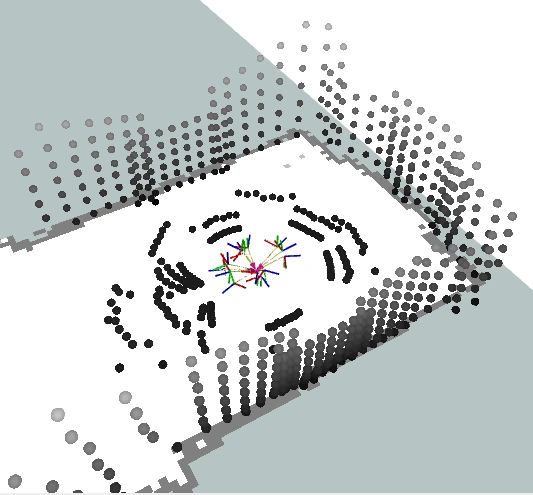
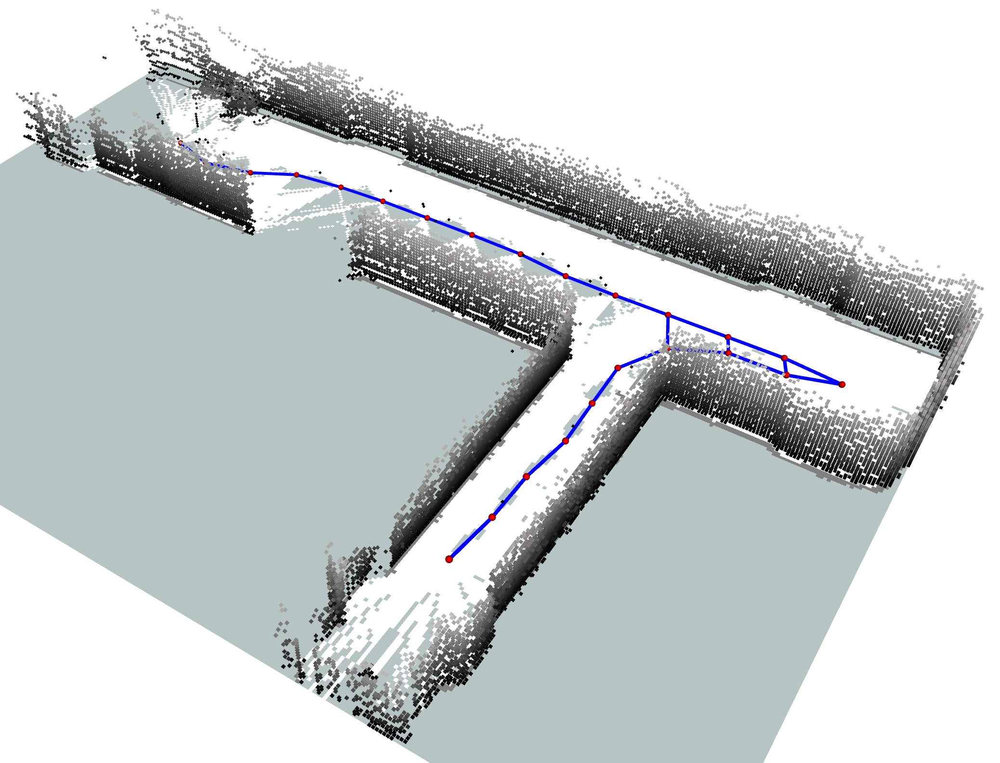

# Wrappers for Other Frameworks

In addition the the examples, the Sensor Ring library has provides for [ROS](https://github.com/EduArt-Robotik/edu_sensorring_ros1) and [ROS2](https://github.com/EduArt-Robotik/edu_sensorring_ros2) which make the integration of the EduArt Sensor Ring in existing projects easy.
 
## 1. ROS Wrapper <a href="https://github.com/EduArt-Robotik/edu_sensorring_ros1"></a>

The Ros1 wrapper publishes the Time of Flight Sensor measurements as [PointCloud2](hhttps://docs.ros.org/en/noetic/api/sensor_msgs/html/msg/PointCloud2.html) message and the thermal measurements as [Image](https://docs.ros.org/en/noetic/api/sensor_msgs/html/msg/Image.html) message.
In addition the pose of each sensor is published as a static transformation.

> ℹ️ Using the ROS Wrapper does not require you to install the Sensor Ring Library manually. The ROS build will automatically fetch the library if it is not detected by CMake.

<div class="tabbed">

- <b class="tab-title">**ROS Native**</b><div class="darkmode_inverted_image">
    ```sh
    mkdir catkin_ws/src -p
    cd catkin_ws
    git clone https://github.com/EduArt-Robotik/edu_sensorring_ros1.git ./src
    catkin_make -DCATKIN_WHITELIST_PACKAGES="edu_sensorring_ros1"
    source devel/setup.bash
    roslaunch edu_sensorring_ros1 usb_sensorring.launch
    ```
    > ℹ️ The parameters of the Sensor Ring are defined in the <a href="https://github.com/EduArt-Robotik/edu_sensorring_ros1/blob/master/params/usb_sensorring_params.yaml">native ROS parameter file</a> and have to be adjusted to match the actual sensor configuration.

  </div>

- <b class="tab-title">**ROS in Docker**</b><div class="darkmode_inverted_image">
    ```sh
    git clone https://github.com/EduArt-Robotik/edu_sensorring_ros1.git
    cd edu_sensorring_ros1/docker/
    docker compose build
    docker compose up -d
    ```
    > ℹ️ The parameters of the Sensor Ring are defined in the <a href="https://github.com/EduArt-Robotik/edu_sensorring_ros2/blob/master/docker/launch_content/sensorring_params.yaml">Docker parameter file</a> and have to be adjusted to match the actual sensor configuration.

  </div>
</div>

## 2. ROS2 Wrapper <a href="https://github.com/EduArt-Robotik/edu_sensorring_ros2"></a>

The Ros2 wrapper publishes the Time of Flight Sensor measurements as [PointCloud2](https://docs.ros2.org/foxy/api/sensor_msgs/msg/PointCloud.html) message and the thermal measurements as [Image](https://docs.ros2.org/foxy/api/sensor_msgs/msg/Image.html) message.
In addition to the sensor messages the pose of each sensor is published as a static transformation.

> ℹ️ Using the ROS2 Wrapper does not require you to install the Sensor Ring Library manually. The ROS2 build will automatically fetch the library if it is not detected by CMake.

<div class="tabbed">

- <b class="tab-title">**ROS2 Native**</b><div class="darkmode_inverted_image">
    ```sh
    mkdir ros2_ws/src -p
    cd ros2_ws
    git clone https://github.com/EduArt-Robotik/edu_sensorring_ros2.git ./src
    colcon build --packages-select edu_sensorring_ros2 --symlink-install --event-handlers console_direct+
    source install/setup.bash
    ros2 launch edu_sensorring_ros2 usb_sensorring.launch.py
    ```
    > ℹ️ The parameters of the Sensor Ring are defined in the <a href="https://github.com/EduArt-Robotik/edu_sensorring_ros2/blob/master/params/usb_sensorring_params.yaml">native ROS2 parameter file</a> and have to be adjusted to match the actual sensor configuration.

  </div>

- <b class="tab-title">**ROS2 in Docker**</b><div class="darkmode_inverted_image">
    ```sh
    git clone https://github.com/EduArt-Robotik/edu_sensorring_ros2.git
    cd edu_sensorring_ros2/docker/
    docker compose build
    docker compose up -d
    ```
    > ℹ️ The parameters of the Sensor Ring are defined in the <a href="https://github.com/EduArt-Robotik/edu_sensorring_ros2/blob/master/docker/launch_content/sensorring_params.yaml">Docker parameter file</a> and have to be adjusted to match the actual sensor configuration.

  </div>
</div>

<div align=center>
<table style="border: none; table-layout: fixed; width: 100%;">
<tr>
  <td style="text-align:center; padding: 20px;">
    <br>
    3D point cloud from the sensor system on a mobile robot visualized with Rviz
  </td>
  <td style="text-align:center; padding: 20px;">
    <br>
    3D map of a corridor recorded with the sensor system using <a href="https://octomap.github.io/">Octomap.</a>
  </td>
</tr>
</table>
</div>

<div class="section_buttons"> 

| Read Previous | |
|:--|--:|
| [Examples](05_examples.md) | |

</div>
